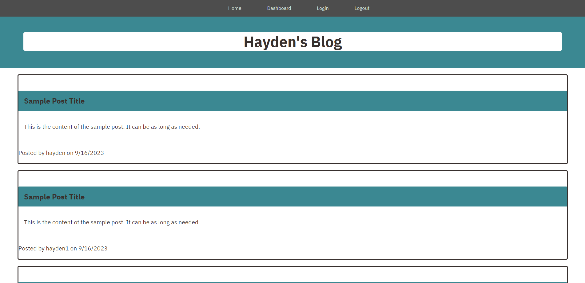

# Hayden's Blog

## Features

- **Dashboard**: Access your personal dashboard to manage and publish your own posts.
- **User-Friendly**: The user interface is designed for ease of use and navigation.
- **Responsive**: The website is fully responsive, ensuring a seamless experience on various devices.
- **Create Posts**: Easily create and publish your own posts.
- **Read Posts**: Browse and read posts on various posts contributed by the community.

## Installation

To set up a local development environment:

# Clone this repository
git clone https://github.com/your-username/your-blog.git

# Install the necessary dependencies
cd your-blog
npm install

# Start the development server
node server.js

## Usage
Homepage: Visit the homepage to explore the latest posts.
Dashboard: Log in to your dashboard to manage and create your own posts.
Navigation: Use the navigation menu to easily switch between the homepage, dashboard, and log out.
Create a New Post: Click on "Create a new post!" in the footer to start writing your post.

## Contributing
If you'd like to contribute to Hayden's Blog, please follow these steps:

Fork the repository.
Create a new branch for your feature or bug fix.
Make your changes and commit them with descriptive messages.
Push your changes to your fork.
Open a pull request to the main repository.